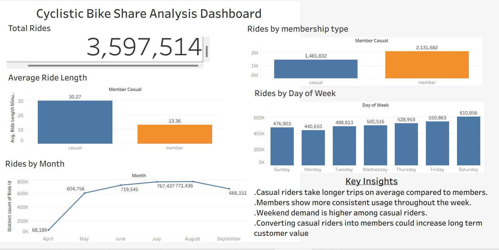

# 🚲 Cyclistic Bike Share Analysis (April–September 2023) | SQL • Power BI • Tableau

## Project Overview

**Dataset:** Divvy Trips Dataset (Cyclistic Case Study)

This project analyzes Cyclistic's historical bike-share data to understand the differences between **annual members** and **casual riders**. Using **MySQL** for data preparation and both **Power BI** and **Tableau** for visualization, the analysis identifies usage patterns and provides data-driven recommendations to help increase annual memberships.

---

## Dashboard Preview

### Power BI Dashboard


### Tableau Dashboard



---

## Project Highlights

- 📊 Analyzed **3,597,514** bike-share trips from April–September 2023.
- 🗄️ Cleaned and transformed data using **MySQL**.
- 📈 Built interactive dashboards in both **Power BI** and **Tableau**.
- 📅 Identified weekly and monthly riding trends.
- 💡 Generated business recommendations to support membership growth.

---

## Business Task

The objective of this project was to answer the following business questions:

- How do annual members and casual riders use Cyclistic bikes differently?
- What patterns can be identified in ride frequency and ride duration?
- How can Cyclistic encourage casual riders to become annual members?

---

## Tools Used

- **MySQL** – Data importing, cleaning, transformation, and analysis.
- **Power BI** – Interactive dashboard creation, DAX measures, KPIs, and business reporting.
- **Tableau Desktop** – Interactive dashboard development and visualization.
- **Excel/CSV Files** – Original data source.

---

## Data Preparation

The dataset was prepared through the following steps:

- Imported monthly Cyclistic trip data into MySQL.
- Combined multiple monthly datasets into a single analysis table.
- Cleaned and standardized date and time fields.
- Calculated ride duration using trip start and end timestamps.
- Created additional fields including **Month** and **Day of Week**.
- Validated and prepared the dataset for visualization in **Power BI** and **Tableau**.

---

## Analysis & Insights

### 1. Rider Type Analysis

| Rider Type | Total Rides | Percentage |
|------------|------------:|-----------:|
| Member | 2,131,682 | 59.3% |
| Casual | 1,465,832 | 40.7% |

**Insight**

Annual members generated the majority of rides, demonstrating a strong membership base. However, casual riders still represent a substantial opportunity for membership conversion.

---

### 2. Average Ride Length

| Rider Type | Average Ride Length |
|------------|-------------------:|
| Casual | 30.27 minutes |
| Member | 13.36 minutes |

**Insight**

Casual riders spend more than twice as long on each trip compared to members, suggesting recreational usage, while members primarily use bikes for shorter, routine journeys.

---

### 3. Weekly Ride Pattern

| Day | Total Rides |
|------|------------:|
| Sunday | 476,903 |
| Monday | 440,610 |
| Tuesday | 488,813 |
| Wednesday | 500,516 |
| Thursday | 528,953 |
| Friday | 550,863 |
| **Saturday** | **610,856** |

**Insight**

Ride activity steadily increases toward the weekend, with Saturday recording the highest number of trips, indicating increased leisure riding.

---

### 4. Monthly Ride Trend

| Month | Total Rides |
|--------|------------:|
| April | 63,189 |
| May | 604,756 |
| June | 719,545 |
| July | 767,437 |
| **August** | **771,436** |
| September | 666,151 |

**Insight**

Bike usage increased throughout the summer months, peaking in August before declining in September. Seasonal demand presents an opportunity for targeted marketing campaigns.

---

## Recommendations

### 1. Convert Casual Riders into Members

Target casual riders through:

- Membership discounts
- Limited-time conversion offers
- Loyalty rewards
- In-app membership promotions

### 2. Focus Marketing During Peak Periods

Launch membership campaigns during **August** and on **weekends**, when rider activity is highest.

### 3. Develop Rider-Specific Marketing

Promote the cost savings and convenience of annual memberships to casual riders who frequently take longer recreational trips.

---

## Conclusion

This analysis demonstrates that Cyclistic has a strong annual membership base while highlighting significant opportunities to convert casual riders into members. By leveraging seasonal trends and rider behavior, the company can develop targeted marketing strategies to increase annual memberships.

---

## Skills Demonstrated

- SQL Data Cleaning & Transformation
- Data Analysis
- Power BI Dashboard Development
- Tableau Dashboard Development
- DAX Measures
- KPI Design
- Data Visualization
- Business Intelligence
- Data Storytelling

---

## Project Structure

```text
cyclistic-bike-share-analysis

├── README.md
├── SQL
│   └── Cyclistic_Analysis.sql
├── Tableau
│   └── cyclistic_dashboard.twbx
├── PowerBI
│   └── cyclistic_dashboard.pbix
└── Dashboard
    ├── cyclistic_dashboard.png
    └── cyclistic_powerbi_dashboard.png
```
